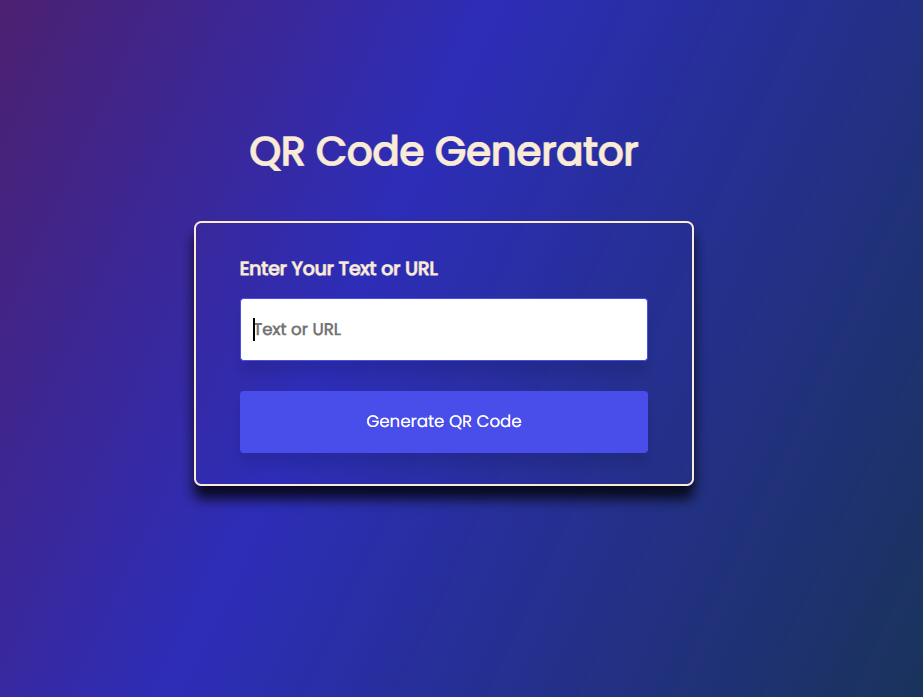
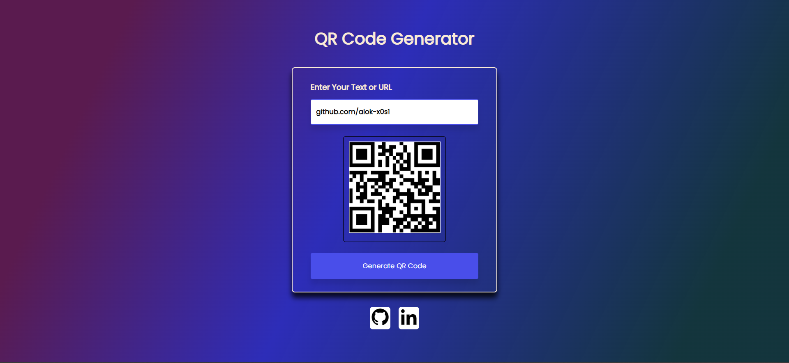

# QrSwift | A QR Code Generator

QrSwift is a lightweight QR code generator website built with HTML, CSS, and JavaScript for quick and easy QR code creation.

## Features

- **User-Friendly Interface**: Simple and intuitive design for easy navigation.
- **Fast QR Code Generation**: Quickly generate QR codes for various purposes.

## Live Preview
  - [QrSwift](https://qrswift.vercel.app/)

## ScreenShot 

- **Home Screen**

- **Result Screen**

## Technologies Used

- HTML
- CSS
- JavaScript

## Development

To run the project locally:

1. Clone this repository.
2. Open the `index.html` file in your web browser.
